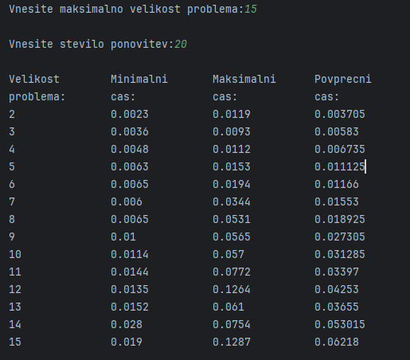
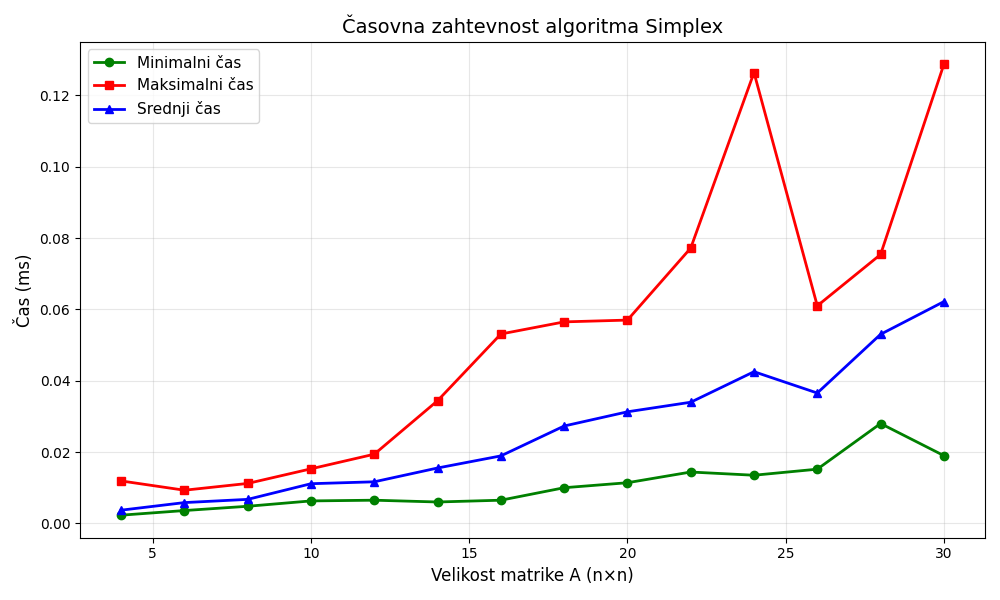

# IZBRANI ALGORITMI – Simplex

V tej nalogi sem implementiral tehniko linearnega programiranja Simplex.

---
## Analiza časovne zahtevnosti

Za velikosti problema (n) na intervalu [2, 15] sem ustvaril naključno matriko A
(dimenzije (n+m) × (n+m), kjer je m=n, torej 2n × 2n) in vektorja b ter c,
ki so vsebovali naključna števila na intervalu [0, 999]. Nad njimi sem zagnal
algoritem Simplex in meril čas izvajanja. Za vsako velikost problema sem izvedel
20 ponovitev ter na graf izpisal minimalni, maksimalni in srednji (povprečni)
čas izvajanja.

## Analiza numerične stabilnosti

