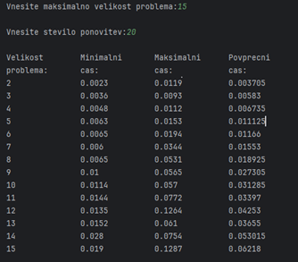
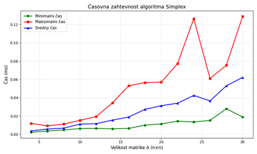
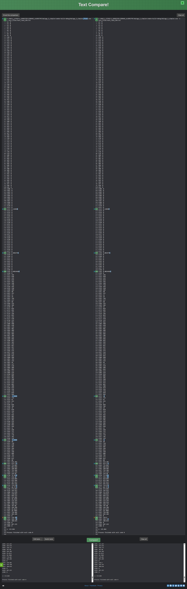

# IZBRANI ALGORITMI – Simplex

V tej nalogi sem implementiral tehniko linearnega programiranja Simplex.

---
## Analiza časovne zahtevnosti

Za velikosti problema (n) na intervalu [2, 15] sem ustvaril naključno matriko A
(dimenzije (n+m) × (n+m), kjer je m=n, torej 2n × 2n) in vektorja b ter c,
ki so vsebovali naključna števila na intervalu [0, 999]. Nad njimi sem zagnal
algoritem Simplex in meril čas izvajanja. Za vsako velikost problema sem izvedel
20 ponovitev ter na graf izpisal minimalni, maksimalni in srednji (povprečni)
čas izvajanja.





## Analiza numerične stabilnosti 

Algoritem sem testiral z uporabo podatkovnih tipov float double na različnih primerih. 

1. **Preizkus na podanih primerih iz estudija:**
- Vse podane txt primere sem preizkusil na implementaciji z float in double, ter primerjal njihove rezultate. Na njih nisem opazil razlik, predvidevam, da zato ker so primeri predobro pogojeni:
  - koeficienti v matriki so večinoma cela in med seboj precej različna števila, 
  - pivotni elementi niso majhni,
  - ne prihaja do skoraj enakih razmerij pri testu minimalnega količnika.

2. **Vpliv vrstnega reda omejitev**

Na težjih vhodnih primerih sem dodatno preizkusil vpliv spremembe vrstnega reda omejitev. Pri tem sem uporabil isti testni primer (simplexTezko.txt => simplexTezko_swap.txt) in zgolj permutiral vrstice matrike A ter pripadajoče elemente vektorja b.
Rezultati kažejo, da sprememba vrstnega reda omejitev v tem primeru ni vplivala na končno rešitev. Tako pri uporabi podatkovnega tipa double kot tudi float je algoritem Simplex konvergiral k isti optimalni rešitvi.
To kaže, da je obravnavani problem numerično dobro pogojen in da sprememba vrstnega reda omejitev ne povzroči spremembe zaporedja pivotov niti numeričnih odstopanj med uporabo 32-bitne in 64-bitne aritmetike.


3. **Generiranje novega testnega primera ```test_rand.txt```**:
- Pri tem poskusu sem generiral različne testne primere, testni primeri so bili enaki kot na estudiju (spodnja trikotna matrika), razlikovala se je le velikost.
- Testiral sem matrike A velikosti n x n, kjer je n bil:
  - 10 -> Tukaj nisem opazil nobenega odstopanja,
  - 50 -> Odstopanje na sedmih elementih x,
  - 100 -> Odstopanje na enem elementu x,
  - 150 -> Odstopanje na 12-ih x-ih.1

- Ugotovitev: Razlike med float in double so se začele pojavljati pri problemih velikosti približno n ≥ 50, pri čemer so se z večanjem dimenzije problema razlike v rešitvah pogosteje pojavljale.

Izpis primera ```n = 150```:
